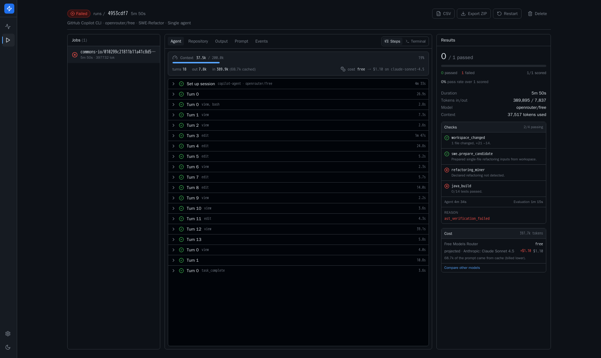

# Refactor Platform

**A plugin-driven platform for running and evaluating repository-scale
code-refactoring agents.**

Live demo: <http://16.192.54.8:8787/> · [Deployment](docs/deployment.md) ·
[Results](docs/results.md) · [Evaluation](docs/evaluation.md) · MIT licensed



## The problem

Coding agents are evaluated on whether a patch applies and a test goes green.
For *refactoring* that is not enough. A refactoring is correct when the code
still does what it did **and** the transformation the task asked for actually
happened. An agent can make a suite pass by deleting the hard part, or perform a
textbook Extract Method that fails to compile. Text diffs cannot tell these
apart, and neither can a single pass/fail bit.

Worse, when a repository-scale build fails it is genuinely hard to know whether
the *agent* broke it or the *harness* did. During this work, four consecutive
"agent failures" turned out to be a truncated build command shipped inside a
benchmark's own dataset.

## What it does

Given a benchmark task — a repository pinned at a commit, plus a refactoring
instruction — the platform:

1. Materializes a clean, history-free workspace from bootstrapped local data.
   No network is touched at task time.
2. Spawns the chosen agent CLI under a **platform-owned PTY**, streaming every
   byte to a single `terminal.log`. The live view and the replay are the same
   bytes; nothing is reconstructed.
3. On agent exit, captures the diff and runs the benchmark's **staged evaluation
   pipeline** — real test suites, real builds, real AST checks.
4. Persists a replayable record: the exact repo state, the exact prompt, the
   diff, the agent's own event log, the raw build output, and a pass/fail with a
   machine-readable reason.

Correctness is established by two redundant checks that disagree in useful ways:
[RefactoringMiner](https://github.com/tsantalis/RefactoringMiner) confirms the
*named* refactoring is present in the AST, and the project's own build and test
suite confirm behaviour is preserved. See [docs/evaluation.md](docs/evaluation.md).

## What ships

* **Two benchmarks as plugins** — RefactorBench (300 Python tasks; 100 tasks ×
  3 prompt modes) and SWE-Refactor (1099 Java tasks across 18 projects).
* **One agent tool as a plugin** — GitHub Copilot CLI, BYOK.
* **Four execution setups** as platform core — `S1` (single agent), `S1-LSP`
  (with a language server), `S1-eval` (with an in-session self-check loop over
  the benchmark's own checks), `S3` (native sub-agents).
* **Live operator dashboard** — agent steps, the diff growing in the working
  tree, VS-Code-style repository navigation, per-stage build/test logs, the
  benchmark's checks sitting pending until they resolve, and live token, context
  and cost accounting with projection onto any model in the provider catalog.
* **CSV export** with 31 analysis columns per task, including `codebleu`,
  `contextTokens`, `compactionCount`, `contextOverflowCount` and `costUsd`.

The core knows **no benchmark and no agent by name**. Plugins import only from
`app.catalog.sdk`, and a test enforces that boundary.

## Novelty

Existing harnesses (SWE-bench and its descendants) answer *did the patch pass
the tests*. This platform answers *did the requested transformation happen, was
behaviour preserved, and what did it cost* — and it makes the harness itself
falsifiable. Before any Java verdict is trusted, an unmodified checkout must
build green under the identical command, JDK, locale and user. That **baseline
gate** turned four "model failures" into one dataset bug (see
[docs/evaluation.md](docs/evaluation.md)).

It is also honest about what it cannot see. The agent reports output tokens per
message but prompt tokens and true context occupancy only at session shutdown,
so mid-run the dashboard shows what was measured and says the rest is not yet
reported, rather than extrapolating a plausible number.

## Who it is for

Researchers comparing agent scaffolds on refactoring; practitioners deciding
whether an agent can be trusted against their own repository; benchmark authors
who need a runner that will not silently attribute its own bugs to a model.

## Quick start

```bash
cp .env.example .env          # add your OPENROUTER_API_KEY
docker compose up -d --build  # dashboard :3000
```

`openrouter/free` runs the entire platform at zero cost. Full instructions,
including how to bootstrap benchmark data and serve on another port, are in
[docs/deployment.md](docs/deployment.md).

## Selected results

Every setup, both benchmarks, executed end-to-end against a live provider. On
SWE-Refactor the bare single agent wrote invalid Java and broke the build, while
a language server, a self-check loop, and sub-agent delegation each recovered
the same task and passed the project's full 2032-test suite.

On RefactorBench, prompt specificity dominates scaffolding: moving from a *lazy*
prompt to a *descriptive* one lifts the baseline agent 44 → 71 (+27 pp), while
adding a language server to the descriptive prompt moves it 71 → 73 (+2 pp).

Compound refactorings remain unsolved: Extract & Move verifies 30/142, while
Move & Rename (0/21) and Move & Inline (0/14) never do.

Details, figures and the baseline gate: [docs/results.md](docs/results.md).

## Architecture

```
web/  Next.js dashboard ──/api,/ws──▶ server/ FastAPI
                                        ├─ catalog/    plugin discovery + SDK boundary
                                        ├─ execution/  PTY host · workspaces · setups · task loop · queue
                                        ├─ evaluation/ staged pipeline (core presets + plugin stages)
                                        ├─ realtime/   in-process hub → WS (terminal) + SSE (status)
                                        └─ results/    export · import · retention
plugins/
  benchmarks/{refbench,swe}/   agents/copilot/   lsp/{pylsp,jdtls}/
```

See [docs/architecture.md](docs/architecture.md).

## Extending

* Add a benchmark → [docs/adding-a-benchmark.md](docs/adding-a-benchmark.md)
* Add an AI CLI tool → [docs/adding-an-agent-tool.md](docs/adding-an-agent-tool.md)
* Reproduce the acceptance runs → [docs/replication.md](docs/replication.md)

## Development

```bash
cd server && uv sync && uv run pytest        # 84 tests
cd web    && npm install && npm test         # 11 tests
```

## License

MIT — see [LICENSE](LICENSE). The bundled benchmarks retain their own upstream
licenses; the platform ships bootstrap scripts, not their data.
