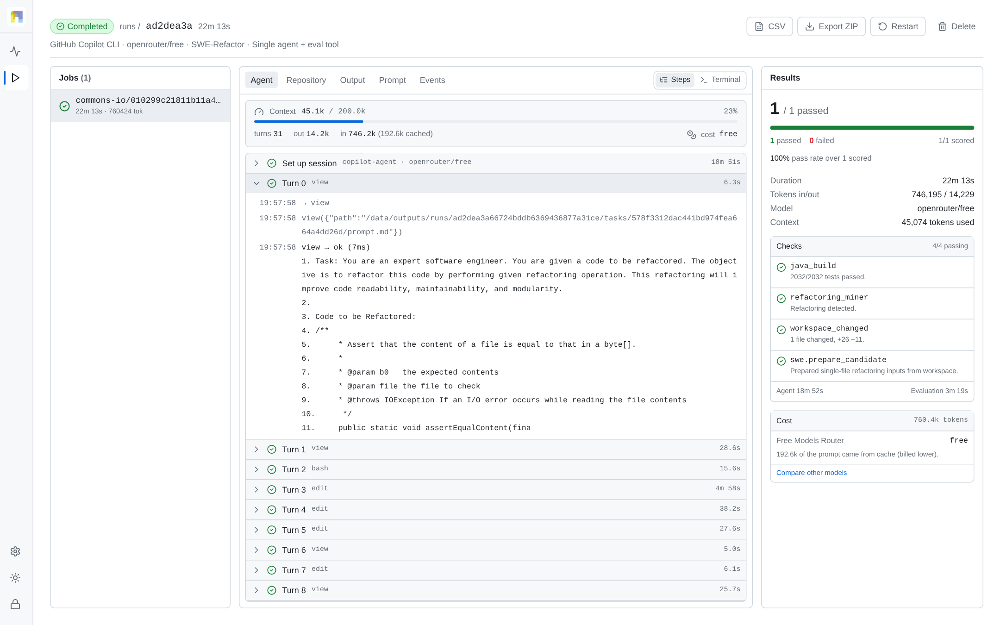
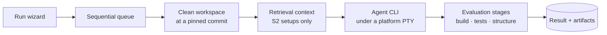

# Refactor Platform

A benchmarking platform for refactoring agents. It runs command-line coding
agents against real repositories under controlled setups, and decides for each
task whether the requested refactoring was actually performed and whether the
project still builds and passes its own test suite.

[](https://github.com/PiSchool/refactor-platform/actions/workflows/ci.yml)
[](LICENSE)
[](server/pyproject.toml)
[](web/package.json)

Accepted to **[EMNLP 2026 — System Demonstrations](https://pischool.github.io/refactor-platform/)**.

<picture>
  <source media="(prefers-color-scheme: dark)" srcset="docs/figures/ui-run-detail-dark.png">
  
</picture>

## What it measures

A refactoring is correct only when it preserves behaviour *and* performs the
transformation that was asked for. Either can hold without the other: an agent
can turn a suite green by deleting the difficult behaviour, and a textbook
Extract Method can fail to compile. The platform therefore evaluates both for
every task — the project's own build and test suite, and a structural reading of
the diff by [RefactoringMiner](https://github.com/tsantalis/RefactoringMiner) —
and retains everything the verdict rests on: prompt, raw terminal bytes, agent
events, diff, evaluation logs and a machine-readable result.

Across the 177 compound Java tasks of the reported study, 59% of attempts were
recognised as the requested refactoring; 24% also left the project compiling and
green. [Results](docs/results.md) derives both figures from the per-task
exports.

## Quick start

Docker with Compose v2, and an API key for one OpenAI-compatible model provider.

```bash
git clone https://github.com/PiSchool/refactor-platform.git refactor-platform
cd refactor-platform
cp .env.example .env      # provider key and the two database passwords
docker compose up -d --build
```

The dashboard is served at <http://localhost:3000>. Two things are provisioned
in the background on first start: benchmark data, whose progress is under
**Settings → Benchmarks**, and the retrieval models the study used, whose
progress is under **Settings → Services**. Runs become available as each
benchmark completes; S2 and S3 runs are refused, with that reason, until the
models are present. The models are named in `config.yaml` and described in
[Retrieval (S2)](docs/retrieval.md).

```bash
docker compose ps               # service health
docker compose logs -f backend  # startup and run logs
docker compose down             # stop, retaining data
```

The [deployment guide](docs/deployment.md) covers remote hosts, upgrades and
backups.

## How a run works



Each task starts from a clean workspace materialised from data provisioned
ahead of time, so nothing is downloaded while an agent is running. The agent
executes under a platform-owned pseudo-terminal: raw bytes are written to
`terminal.log` and streamed to the browser, which makes a run watchable live and
replayable byte-for-byte afterwards. On exit or timeout the platform captures
the diff and runs the benchmark's real builds, tests and structural checks.
Runs and tasks execute one at a time, so durations and token counts remain
comparable across configurations.

## Extending it

Adding a benchmark, an agent CLI, an evaluation metric or a language server
takes no change to the platform's own code. Each one is a directory holding a
manifest and one Python module; you drop it in and restart. Adding a model
provider is one entry in `config.yaml` and its key in `.env`.

| Add | Where | How |
|---|---|---|
| A benchmark | `plugins/benchmarks/<id>/` | [Adding a benchmark](docs/adding-a-benchmark.md) |
| An agent CLI | `plugins/agents/<id>/` | [Adding an agent tool](docs/adding-an-agent-tool.md) |
| An evaluation metric | `plugins/evaluation/<id>/` | [Evaluation](docs/evaluation.md) |
| A language server | `plugins/lsp/<id>/` | [Extending](docs/extending.md) |
| A model provider | `config.yaml` | [Extending](docs/extending.md#model-providers) |
| Tasks | your benchmark's task list | [Extending](docs/extending.md#tasks) |
| Repositories or corpora | a pinned git ref or a snapshot, named by a task | [Extending](docs/extending.md#repositories) |

Copyable examples are in [`examples/plugins/`](examples/plugins/), and
`CONTRIBUTING.md` gives the command that checks one against the contracts.

## What ships

| | |
|---|---|
| **Benchmarks** | **RefactorBench** — 100 Python tasks in three prompt modes; **SWE-Refactor** — 1,099 Java tasks, including the 177-task compound subset the study reports; **Python Refactorings (live repositories)** — 4 tasks over `toolz` and `more-itertools` at pinned commits |
| **Agent CLIs** | **GitHub Copilot CLI**, **OpenAI Codex CLI**, **Aider**, **Claude Code**, **opencode** and **Junie CLI**, all six installed in the image. Each declares the setups it can honestly run and the request format it sends, so an agent paired with an endpoint that cannot serve it is refused before the run rather than failing inside one |
| **Evaluation metrics** | Ten, each its own directory under `plugins/evaluation/`: Java build and RefactoringMiner detection; for Python, `pyrefactor` names the refactoring by comparing parse trees and `pytest_suite` runs the repository's own suite. A benchmark references any of them by id and defines none itself |
| **Model providers** | OpenRouter, OpenAI, DeepSeek, Groq and Together are declared out of the box, as is any other OpenAI-compatible endpoint — a hosted gateway, vLLM, Ollama or an internal service. The model identifier is free text, so a run is not restricted to a curated list |
| **Retrieval (S2)** | AST-aware chunking, code embeddings in pgvector, exact lexical search, rank fusion, cross-encoder reranking, prompt pre-injection and read-only search tools over MCP, with the resolved index identity recorded per run |
| **Language servers** | `pylsp` for Python, Eclipse **JDT.LS** for Java |
| **Storage** | PostgreSQL with pgvector for run state and retrieval indexes |

### Execution setups

Setups are platform-owned: a benchmark declares which ones it supports, and the
same setup means the same thing for every benchmark and every agent.

| Setup | What the agent gets |
|---|---|
| `s1` | The workspace and the task. Nothing else. |
| `s1_lsp` | A configured language server. |
| `s1_eval` | An in-workspace `eval.sh` it may call to check itself. |
| `s2_rag_naive` | Retrieved context over fixed line windows, pre-injected, plus read-only search tools. |
| `s2_rag_ast` | The same pipeline over whole class and method definitions parsed from syntax trees. |
| `s3` | Native sub-agent delegation. |

### In the dashboard

A live pseudo-terminal, structured agent steps, a repository browser, the live
diff, evaluation checks resolving from pending to passed or failed with their
raw stage logs, and token, context, compaction and cost telemetry when the agent
reports it. Runs can be stopped, skipped, restarted, deleted, imported, and
exported as CSV or as a deterministic ZIP.

## Documentation

| | |
|---|---|
| [Deployment](docs/deployment.md) | Install, harden, upgrade, back up |
| [Configuration](docs/configuration.md) | Environment, runtime settings, credentials |
| [Operator guide](docs/user-guide.md) | Launch, watch, export, interpret |
| [Extending](docs/extending.md) | Benchmarks, agent tools, metrics, providers, tasks, corpora |
| [Architecture](docs/architecture.md) | Plugin boundary, packages, data flow |
| [Evaluation](docs/evaluation.md) | Stages, pass expressions, baseline gate |
| [Retrieval (S2)](docs/retrieval.md) | Chunking, hybrid search, reranking, provenance |
| [Results](docs/results.md) | What was measured, and on how many tasks |
| [Replication](docs/replication.md) | Reproduce the acceptance matrix |
| [Troubleshooting](docs/troubleshooting.md) | When something breaks |

The full index is [`docs/README.md`](docs/README.md).

## Development

```bash
cd server && uv sync && uv run pytest          # backend
cd web && npm ci && npm test && npm run build  # dashboard
```

[CONTRIBUTING.md](CONTRIBUTING.md) describes the plugin boundary, the review
expectations and the checks that run in CI. Vulnerabilities go to the private
channel in [SECURITY.md](SECURITY.md) rather than to a public issue.

## Access control

One deployment, for one operator, with no application-level authentication; the
lock screen is presentation only. Both host mappings default to loopback, so
reaching the dashboard from another machine is an SSH tunnel:

```bash
ssh -L 3000:127.0.0.1:3000 user@host
```

Publishing it to a network requires a reverse proxy that provides TLS and
authentication. To share results instead, export a run: the archive carries the
evidence without the deployment.

## Contributors

- [Aziz Ben Amor](https://www.linkedin.com/in/aziz-benamor/) — Pi School (equal contribution)
- [Drish Mali](https://www.linkedin.com/in/drish-mali/) — Pi School (equal contribution)
- [Mann Acharya](https://mannacharya.com) — Pi School (equal contribution)
- [Vijayasri Iyer](https://www.linkedin.com/in/vijayasriiyer/) — Pi School (corresponding author)
- [Sébastien Bratières](https://www.linkedin.com/in/sebastien-bratieres/) — Pi School, Translated

[](https://picampus-school.com/)

## License

Platform source code is [MIT](LICENSE). RefactorBench, SWE-Refactor,
RefactoringMiner, GitHub Copilot CLI and every repository downloaded by a
benchmark bootstrap keep their own licenses and terms; none of them are
relicensed or bundled here. Using a model provider or an agent CLI also makes
you responsible for that service's terms, data handling and charges.