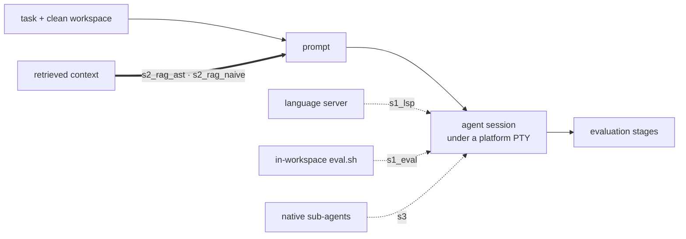

# Architecture

The platform separates three concerns that the original POC entangled:
**what to run** (benchmarks), **what runs it** (agent tools), and **how a run
is executed and judged** (the platform core). The first two are plugins; the
third is fixed platform machinery that plugins configure but never replace.

## The SDK boundary

`server/app/catalog/sdk.py` is the entire plugin-facing surface. Plugins import
from it and nothing else in `app.*`; `tests/test_catalog.py` asserts this. The
core contains no reference to `refbench`, `swe` or `copilot`.

The SDK defines data contracts (`TaskDef`, `WorkspaceSpec`, `CommandSpec`,
`SessionCtx`, `SessionInfo`, `EvalContext`, `StageResult`, `EvalOutcome`,
`SetupProfile`) and four plugin ABCs (`AgentPlugin`, `BenchmarkPlugin`,
`EvaluationPlugin`, `LSPPlugin`).

## What is extensible

| Kind | Discovered from | Contributes |
|---|---|---|
| Benchmark | `plugins/benchmarks/<key>/` | tasks, prompt, evaluation pipeline, supported setups |
| Agent tool | `plugins/agents/<key>/` | how a CLI is launched and how its session is read |
| Evaluation metric | `plugins/evaluation/<key>/` | named stages any benchmark may reference |
| Language server | `plugins/lsp/<key>/` | a server for the `s1_lsp` setup |
| Model provider | `providers:` in `config.yaml` | an OpenAI-compatible endpoint and its key variable |

Providers never reach a plugin as a vendor: the platform resolves the active
entry and passes `RP_PROVIDER`, `RP_PROVIDER_BASE_URL` and
`RP_PROVIDER_API_KEY`, so an adapter is written once and works against any of
them. Setups are deliberately not extensible, for the reason given below.
[Extending](extending.md) documents each contract.

## Layers

| Package | Responsibility |
|---|---|
| `catalog/` | Discover plugins from `plugins/`, validate manifests, sync catalog rows, bootstrap benchmark data. Invalid plugins are collected into an error list; the platform never crashes. |
| `execution/` | `pty_host` (owned PTY), `workspace` (materialize + diff), `setups` (fixed profiles), `taskloop` (per-task orchestration), `worker`/queue (sequential runs), and `evaltool` (self-check installer). |
| `retrieval/` | AST-aware Python/Java chunking, strict index identity, hybrid search (pgvector/BM25) with fusion and cross-encoder reranking, deterministic or generative query expansion, prompt context, MCP tools, selectable model profiles, health, and provenance. |
| `evaluation/` | `engine` resolves an ordered stage list, runs each over a shared `EvalContext`, and computes `passed` from a boolean expression over stage names. `presets/` holds the core stages; `registry` holds those contributed by metric plugins. |
| `realtime/` | In-process `hub` pub/sub. WS streams terminal bytes; SSE streams status/events. No DB polling. |
| `results/` | Deterministic ZIP export, import, and run retention. |
| `api/` | Thin FastAPI routers; serializers emit camelCase for the web app. |

## Execution model

- **Owned PTY, not tmux.** The platform calls `pty.openpty()` and appends every
  byte to `terminal.log`. That file *is* the live source (tailed to the WS) and
  the replay source. Completion = process exit. Timeout = `killpg`. There is no
  separate "runner exit code" channel and no reconstructed transcript.
- **Sequential queue.** One run at a time (`execution/worker.py`), so resource
  contention and Java builds never overlap.
- **Clean workspaces.** `git` provider archives from a bare mirror at a pinned
  ref; `snapshot` copies a data directory. Both end with a fresh `git init`
  baseline so no upstream history leaks the answer.

## Setups (platform core)

Setups are **not** plugins: they are fixed profiles in `execution/setups.py`. A
plugin only *declares compatibility* (`setups:` in its manifest) and *may
contribute a prompt block*.



| Setup | Adds |
|---|---|
| `s1` | Baseline: agent + workspace. |
| `s1_lsp` | Language-server config handed to the agent (via an `LSPPlugin`). |
| `s2_rag_naive` | Mandatory Retrieval (S2) over fixed line windows; hybrid search with pre-injected context plus optional read-only MCP tools. |
| `s2_rag_ast` | The same search pipeline over Python/Java class and method definitions parsed from syntax trees. |
| `s1_eval` | An in-workspace `eval.sh` the agent may call to self-check. **In-session only**: the platform never drives feedback rounds. |
| `s3` | Sub-agent delegation enabled (agent-native), with a guiding prompt block. |

A setup only *offers* LSP, self-evaluation, or sub-agents, so those profiles are
exercised only when the agent uses the mechanism. S2 is different: retrieval and
prompt pre-injection are mandatory platform work, therefore a successful
pre-injection establishes `setupExercised=true`; optional MCP calls are counted
separately as `retrievalInvocations`. No retrieval failure degrades to S1.

The agent manifest must declare every capability required by the selected
setup; incompatible launches are rejected before a run is queued. S1-LSP also
starts the configured server as the same unprivileged user as the agent and
requires a valid LSP `initialize` response. After execution,
`execution/conformance.py` records `conformant`, `setup_not_exercised`, or
`unexpected_capability_use` independently of the benchmark verdict. This keeps
a correct edit from becoming false evidence for a regime the model did not use.

## Evaluation pipeline

`evaluation/engine.py` runs what the benchmark manifest declares: the
benchmark's own `prepare` hook, then the `capture` metrics, then the `verify`
metrics, then the verdict. Every stage name is a metric id, resolved through
`evaluation/registry.py`, and every metric is one directory under
`plugins/evaluation/` whose name is that id; the core defines none. Each returns
a `StageResult` recorded under the metric's id; `passed` is a boolean expression
over the verify stages (`"refactoring_miner and java_build"`). Values pass from
the preparation step to the metrics through `EvalContext.shared`, which is how
SWE-Refactor hands `rm_args` to `refactoring_miner` and its reference text to
`codebleu`.

This is why "refbench and swe are plugins that configure the platform's generic
capabilities": each benchmark picks core capture/verify stages, supplies its own
where needed, and declares the pass expression; no benchmark logic lives in the
core.

Operators may retune a stage's config, disable a stage, or replace the `passed`
expression from Settings. Those edits are stored as overrides and merged at run
time (`effective_pipeline`); the manifest remains the source of truth for which
stages *can* run.

## Data flow of one task

```
workspace.prepare ─▶ [S2: index/search/rerank + retrieval artifacts]
   ─▶ prompt (hook or template + retrieved context + setup.prompt_block)
   ─▶ agent.prepare/command ─▶ run_pty (terminal.log)
   ─▶ agent.parse_session ─▶ workspace.capture_diff
   ─▶ evaluation.evaluate ─▶ persist TaskResult + artifacts
```

Artifacts written per task: `prompt.md`, `response.md`, `diff.patch`,
`terminal.log`, `transcript.txt`, `events.jsonl` (agent-native),
`eval/<stage>.log` (raw build/test output), and `workspace_meta.json`
(baseline sha, changed files). S2 additionally writes `retrieval/context.md`,
`queries.json`, `hits.json`, `provenance.json`, and `invocations.jsonl`.

## Invariants

Each of these was once a defect that produced a wrong verdict about an agent,
and each now has a regression test.

- **Nothing blocks the event loop.** Evaluation shells out to `mvn`/`pytest`
  for minutes; it runs in a thread. The SSE tailer reads only the bytes
  appended since its last tick. File reads and toolchain probes are off-loop.
  A blocked loop stalls every request and surfaces as `socket hang up`.
- **The agent and the evaluation build share one unprivileged identity**
  (`runner`, `execution/sandbox.py`). As root, suites that assert on permission
  denial fail on an *unmodified* checkout; and a root agent leaves scratch in
  `/tmp` the build cannot delete.
- **Platform scaffolding never enters the diff.** `eval.sh` and the agent's LSP
  config land after the baseline commit and are added to `.git/info/exclude`.
  Retrieval indexes and evidence live outside the workspace, so `git add -A`
  cannot sweep them in and `workspace_changed` cannot pass on them alone.
- **Reading the workspace never mutates it.** The live diff stages into a
  throwaway `GIT_INDEX_FILE`; repo status uses `git status --porcelain`.
- **The prompt artifact is the exact bytes handed to the agent** (`-p @prompt.md`).
- **Setups never silently degrade.** Agent capabilities are checked at launch;
  LSP readiness uses the protocol rather than PATH presence; S1-eval attempts
  are capped and persisted; native sub-agent use is proven from agent events.

Before trusting any `java_build` verdict, confirm the unmodified checkout builds
green; see the *baseline gate* in [replication.md](replication.md).

The Compose topology is `frontend` + `backend` + an internal PostgreSQL/pgvector
service, which holds both structured run state and retrieval chunks and
embeddings. SQLite is used only when the backend runs directly without
`DATABASE_URL`, for development and isolated tests. See
[retrieval.md](retrieval.md) for the retrieval models, search, and readiness
rules.
