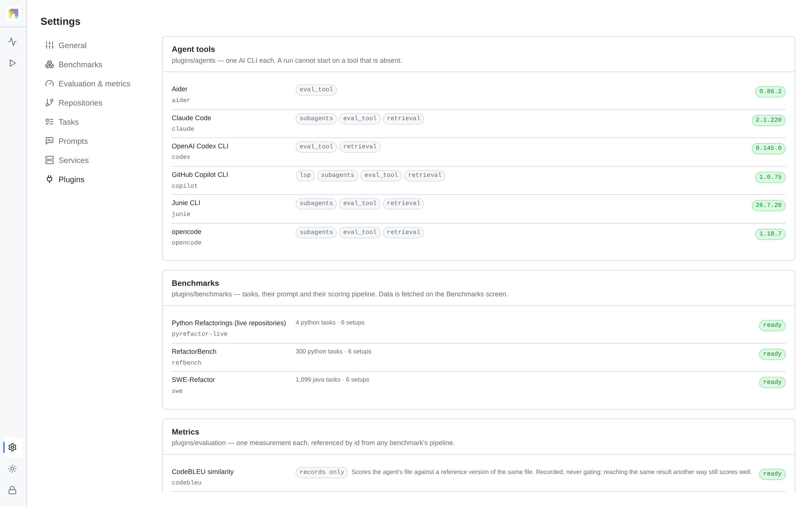

# Extending

The platform owns execution, evidence and evaluation *composition*. What is
measured, who is measured, and against what, are extensions. Each section below
states one extension point's contract, where the platform finds it, and what it
costs to add.

Plugins import from `server/app/catalog/sdk.py` and from nothing else in the
server. A test enforces that boundary, so the core can be refactored as long as
the SDK contracts hold.

| Extension point | Lives in | Needs core changes |
|---|---|---|
| [Benchmarks](#benchmarks) | `plugins/benchmarks/<key>/` | no |
| [Agent CLI tools](#agent-cli-tools) | `plugins/agents/<key>/` | no |
| [Evaluation metrics](#evaluation-metrics) | `plugins/evaluation/<key>/` | no |
| [Model providers](#model-providers) | `config.yaml` and `.env` | no |
| [Tasks](#tasks) | a benchmark's `tasks.yaml` | no |
| [Repositories and corpora](#repositories) | a task's workspace spec | no |
| [Language servers](#language-servers) | `plugins/lsp/<key>/` | no |
| Execution setups | `server/app/execution/setups.py` | yes, by design |

Setups are the exception. `s1` and `s2_rag_ast` have to mean the same thing for
every benchmark and every agent, or cross-configuration results stop being
comparable, so a setup is a platform decision rather than a plugin's.

<picture>
  <source media="(prefers-color-scheme: dark)" srcset="figures/ui-plugins-dark.png">
  
</picture>

Discovery runs at start-up. **Settings → Plugins** lists what was found, and a
plugin that failed to load is listed there with its error rather than being
silently absent.

A plugin's own modules are private to it. Import them relative to the plugin:

```python
from . import events        # this plugin's events.py
import events               # wrong: a name every plugin competes for
```

Two installed plugins may ship a module of the same name — all three shipped
adapters keep their parser in `events.py` — and the loader keeps each one's
own. Tests that import a plugin's file directly bypass that isolation and will
pass while the installed set is broken; use
`app.catalog.loader.import_plugin_module(plugin_dir, "events")`, which is the
same call discovery makes.

## Benchmarks

A benchmark declares what a task is, how to build its prompt, and how to decide
whether the result is correct.

```
plugins/benchmarks/mybench/
  plugin.yaml          manifest: identity, supported setups, evaluation pipeline
  tasks.yaml           the task list (or generated by the bootstrap)
  task.md              template over {task, params}
  data_bootstrap.py    optional: fetch corpora and tools into data/
  plugin.py            optional: Python hooks
```

The manifest's `evaluation` block is the interesting part:

```yaml
evaluation:
  capture: [git_diff, events_metrics]
  verify:
    - {preset: workspace_changed}
    - preset: java_build
      config: {command_from: params.compileCommand, fallback_jdk: 17}
  passed: "workspace_changed and java_build"
```

`capture` collects evidence, `verify` runs measurements, and `passed` is a
boolean expression over verify-stage names. Anything the platform ships is
referenced by its bare name; anything a plugin contributes is namespaced with a
dot.

Three benchmarks ship: **RefactorBench** (100 Python tasks), **SWE-Refactor**
(1,099 Java tasks) and **Python Refactorings (live repositories)**, four tasks
over `toolz` and `more-itertools` at pinned commits. The third is the shortest
worked example of the whole contract — tasks that clone real repositories,
verdicts that come from two plugin metrics — in
`plugins/benchmarks/pyrefactor-live/`. Full walkthrough:
[Adding a benchmark](adding-a-benchmark.md).

## Agent CLI tools

An agent adapter turns a session into a command line, and a finished session
into structured turns. The platform owns the pseudo-terminal, the timeout, the
artifacts and the transcript; the adapter never spawns a process itself.

```python
from app.catalog.sdk import AgentPlugin, CommandSpec, SessionCtx, SessionInfo

class Plugin(AgentPlugin):
    def prepare(self, session: SessionCtx) -> None: ...
    def command(self, session: SessionCtx) -> CommandSpec: ...
    def parse_session(self, events_path, terminal_log_path) -> SessionInfo: ...
```

Provider access arrives in the environment as `RP_PROVIDER`,
`RP_PROVIDER_BASE_URL` and `RP_PROVIDER_API_KEY`. An adapter translates those
into whatever its CLI expects and must not read a vendor-specific variable, so
that changing provider stays a configuration change.

The manifest names the executable the adapter drives and how to install it:

```yaml
binary: mytool
install: npm install -g @vendor/mytool
```

An adapter whose `binary` is not on the backend's `PATH` is offered as
unavailable in the wizard with that install command, and starting a run with it
is refused. Three adapters ship, and the image installs all three executables:

| Adapter | CLI | Setups it can run |
|---|---|---|
| GitHub Copilot CLI | `copilot` | all six |
| OpenAI Codex CLI | `codex` | S1, S1+eval, S2 (retrieval over MCP) |
| Aider | `aider` | S1, S1+eval (its own `--auto-test`) |

Capabilities are declared, not assumed: aider has no MCP client, so the
platform refuses S2 for it instead of running a weaker session under that name.
Codex reaches a provider through the OpenAI Responses API, so an endpoint that
implements only chat completions cannot drive it. Full walkthrough:
[Adding an agent tool](adding-an-agent-tool.md).

## Evaluation metrics

A metric is one directory under `plugins/evaluation/`, and its id is that
directory's name. A benchmark references it by id and configures it; no benchmark
defines a measurement of its own.

[Evaluation](evaluation.md) is the reference: the pipeline a manifest declares,
the ten metrics that ship, and the three files it takes to add one. What matters
here is where the boundary sits.

```
plugins/evaluation/diff_budget/
  plugin.yaml     # type, key (= directory = metric id), name, entrypoint
  plugin.py       # class Plugin(EvaluationPlugin): spec, reason, measure()
```

```python
class Plugin(EvaluationPlugin):
    key = "diff_budget"
    reason = "diff_too_large"                  # recorded when it fails

    spec = MetricSpec(
        title="Change budget",
        summary="Fails a task whose diff touches more lines than the budget allows.",
        requires="nothing beyond the captured diff",
        options=(MetricOption(key="max_changed_lines", label="Budget",
                              type="integer", default=50, unit="lines"),),
        outputs=("changedLines", "budget"),
    )

    def measure(self, ctx: EvalContext, config: dict) -> StageResult:
        ...
```

Any benchmark can then gate on it:

```yaml
verify:
  - workspace_changed
  - {preset: diff_budget, config: {max_changed_lines: 40}}
passed: "workspace_changed and diff_budget"
```

An option's `type` is one of `string`, `integer`, `number`, `boolean`, `choice`
(with `choices`), `list`, or `reference` for a pointer into the task such as
`params.test_file`. Settings renders each as a typed field with the metric's own
default behind it, so an operator retunes a stage without editing YAML.

`spec` is required: a plugin whose title or summary is empty does not load, since
a stage nobody can interpret is worse than no stage. `availability()` reports a
missing tool or library without a task, so it shows on **Settings → Plugins**
instead of inside a failed run. `gates=False` marks a metric that only records;
a benchmark that lists one among its gates is refused.

A minimal example lives in
[`examples/plugins/evaluation/example_metric/`](../examples/plugins/evaluation/example_metric),
and a second in `server/tests/fixtures/plugins/evaluation/fixturemetric/`,
exercised by `server/tests/test_extensibility.py`.

## Model providers

A provider is an entry in `config.yaml`. The platform resolves its endpoint and
key, fetches the model catalogue for the wizard, and hands the agent the neutral
`RP_PROVIDER_*` triple.

```yaml
defaults:
  provider: acme

providers:
  - key: acme
    name: Acme Inference
    base_url: https://llm.acme.example/v1
    api_key_env: ACME_API_KEY
    base_url_env: ACME_BASE_URL        # optional per-deployment override
    credits: false                     # true only if the provider serves GET /key
```

The model list is not declared here: the platform reads `GET /models` from the
endpoint, so the picker offers what the provider actually serves.

```dotenv
ACME_API_KEY=...
```

Requirements and consequences:

- The endpoint must be OpenAI-compatible. Hosted routers, vendor APIs with a
  compatibility layer, vLLM, Ollama, LM Studio and internal gateways all
  qualify.
- `RP_PROVIDER` overrides `defaults.provider` per deployment, so several
  deployments can share one configuration file.
- The model id is free text in the run wizard; the catalogue is a convenience,
  not an allowlist. The published campaign used a free router, and any model the
  configured key can reach runs the same way.
- The provider's key variable is added to redaction automatically, so evidence
  from a provider the platform has never heard of is sanitised like any other.
- Keys are read from the environment when a session starts. They are never
  written to the database, an export, or the API; **Settings → Services** shows
  only whether each key is present.

## Tasks

Tasks come from the benchmark's `tasks.yaml`, either checked in or produced by
its bootstrap:

```yaml
tasks:
  - task_key: commons-io/010299c-extract-method
    title: Extract the file reading loop
    language: java
    workspace: {type: git, source: repositories/commons-io, ref: 010299c…}
    instructions_file: prompts/010299c.md
    params: {refactoringType: Extract Method, filePathBefore: src/…/TestUtils.java}
```

`params` is free-form and reaches three places: the prompt template, the
evaluation stages (`command_from: params.compileCommand`), and the run wizard's
facet filters, which are declared in the manifest:

```yaml
facets:
  - {key: refactoringType, label: Refactoring type}
```

An operator selects tasks in the wizard by facet, by search, or individually,
and can inspect the resolved list under **Settings → Tasks**. Adding tasks means
editing the benchmark's task file — there is no separate upload endpoint for a
task list; a private task set is a small benchmark plugin of its own, which is
also what keeps its provenance attached to its results.

## Repositories

A task's `workspace` declares where its code comes from, and the platform
materialises a clean copy per task from a cached bare mirror:

| Field | Meaning |
|---|---|
| `type: git` | clone from `source`, checked out at `ref` |
| `type: snapshot` | copy a directory tree from `source` |
| `source` | path under the benchmark's `data/`, or a URL for the bootstrap to fetch |
| `ref` | commit to check out; a pinned commit, not a branch |

Pointing a benchmark at your own repositories is therefore a matter of what its
bootstrap fetches and what its task entries reference. Nothing is downloaded
while an agent is running: a run starts only once its benchmark's data is
provisioned, so network flakiness cannot be mistaken for agent behaviour.

Pin commits rather than branches. A moving `ref` silently changes what a result
means, and the run that recorded it can no longer be reproduced.

## Language servers

`plugins/lsp/<key>/` supplies a language server for the `s1_lsp` setup: the
adapter reports whether the server is available and how to launch it for a
workspace. The shipped ones are `pylsp` for Python and JDT.LS for Java.

## Checklist for a new plugin

- It imports only from `app.catalog.sdk`.
- Its manifest validates: `python -c "from app.catalog.loader import discover; print(discover(Path('plugins')).errors)"` reports no error for it.
- It appears under **Settings → Plugins** after a restart.
- It has a test in `server/tests/` that exercises it through the platform, not
  only in isolation.
- A failure inside it produces a stated reason rather than a silent skip.
