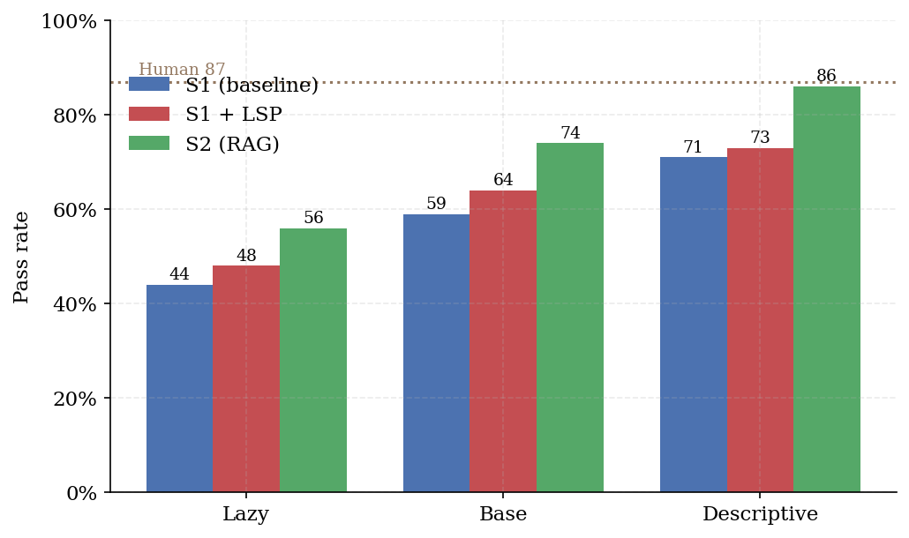
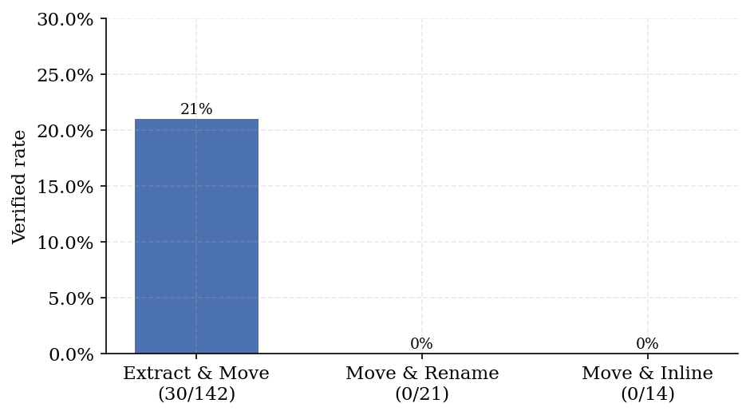

# Results

Two kinds of numbers live in this document, and they are kept apart on purpose.

* **Platform acceptance** — produced by this repository, reproducible today with
  the commands in [replication.md](replication.md).
* **Study results** — produced with the same platform during a larger campaign.
  They motivate the tool; they are not re-run by `make accept`.

Nothing here is estimated. Where a number could not be measured it is absent
rather than approximated.

---

## 1. Platform acceptance

Every setup, on both benchmarks, one task each, executed end-to-end against a
live provider (`openrouter/free`, GitHub Copilot CLI). Verdicts come from real
test suites and real builds — no mocks, no recorded fixtures.

| Benchmark | Setup | Passed | Agent | Eval | Decisive check |
|---|---|---|---|---|---|
| RefactorBench | S1 | ✗ | 268 s | <1 s | `workspace_changed`: no changes were made |
| RefactorBench | S1-LSP | ✓ | 474 s | <1 s | `python_tests`: 5/5 |
| RefactorBench | S1-eval | ✓ | 401 s | <1 s | `python_tests`: 5/5 |
| RefactorBench | S3 | ✗ | 1161 s | <1 s | `python_tests`: 3/5 |
| SWE-Refactor | S1 | ✗ | 275 s | 75 s | `java_build`: compilation failed |
| SWE-Refactor | S1-LSP | ✓ | 939 s | 239 s | `java_build`: 2032/2032 |
| SWE-Refactor | S1-eval | ✓ | 381 s | 201 s | `java_build`: 2032/2032 |
| SWE-Refactor | S3 | ✓ | 749 s | 185 s | `java_build`: 2032/2032 |

Read the SWE row group: the bare single agent wrote syntactically invalid Java
and broke the build, while a language server, a self-check loop, or sub-agent
delegation each recovered the same task and passed the project's full suite.
The `2032` is the entire `commons-io` test suite, and it is the same count an
**unmodified checkout** produces — see the baseline gate below.

### The baseline gate

A verdict of "the agent broke the build" is worthless unless an untouched
checkout builds green under the identical command, JDK, locale and user. Before
any SWE-Refactor result is trusted, the platform's own command is replayed on a
clean clone:

```
BUILD SUCCESS · Tests run: 2032, Failures: 0, Errors: 0, Skipped: 15
```

This gate has repeatedly caught harness defects that would otherwise have been
recorded as agent failures — a missing locale making the JVM default to ASCII, a
root-vs-runner identity mismatch, a `java.io.tmpdir` override that broke
`FilesUncheckTest`, and a truncated build command shipped inside the benchmark
data itself. Each was a *harness* bug wearing an *agent* bug's clothes.

---

## 2. Study results

### Prompt specificity dominates scaffolding



RefactorBench, 100 tasks, pass rate. Holding the setup fixed, moving from a
*lazy* prompt (what, only) to a *descriptive* one (what + where + how) lifts the
baseline single agent from **44 → 71** (+27 pp). Adding a language server to the
descriptive baseline moves it **71 → 73** (+2 pp). The prompt is worth an order
of magnitude more than the tool.

Retrieval augmentation (S2, the green bar) reaches **86**, within one point of
the **87** human reference. S2 is a study configuration; the setups shipped in
this repository are S1, S1-LSP, S1-eval and S3.

### Compound refactorings are where agents fall over



SWE-Refactor compound set (177 tasks), single agent, single pass, verified by
RefactoringMiner **and** a green build. Extract & Move succeeds 30/142 (21 %).
Move & Rename (0/21) and Move & Inline (0/14) never succeed: both require the
agent to update every reference across the repository, and a change that
compiles in one file breaks another.

This is the failure mode the platform exists to observe. A benchmark that only
diffed the target file would score these as partial successes; requiring the
*project's own build and test suite* to pass makes the failure legible.

---

## Reproducing

Acceptance results: `docs/replication.md`. Study results were produced with the
same evaluation pipeline over the full task sets; the per-task CSV export
(`/api/runs.csv`) carries every column used to build these figures, including
`codebleu`, `contextTokens`, `compactionCount` and `costUsd`.
