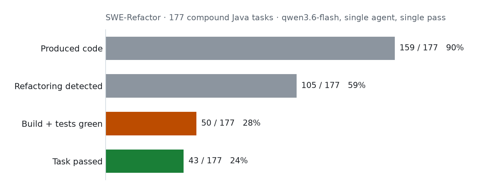
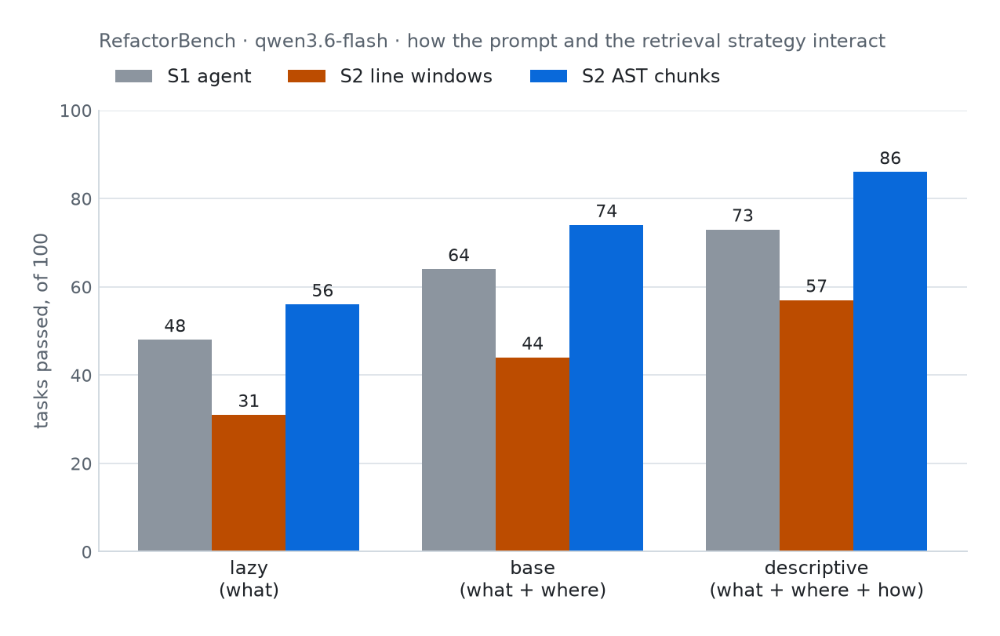
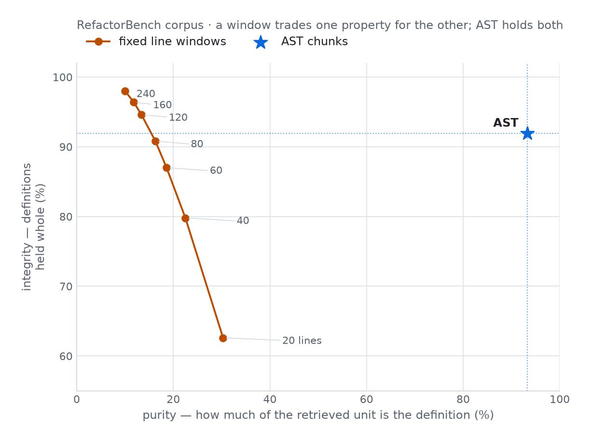
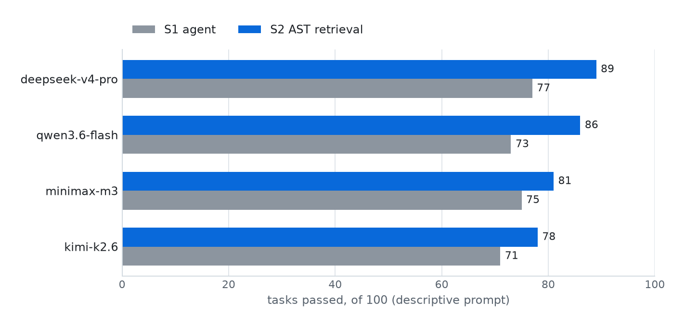
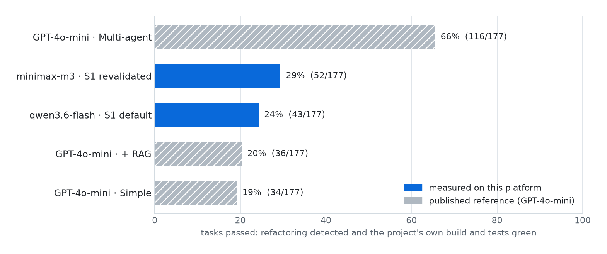
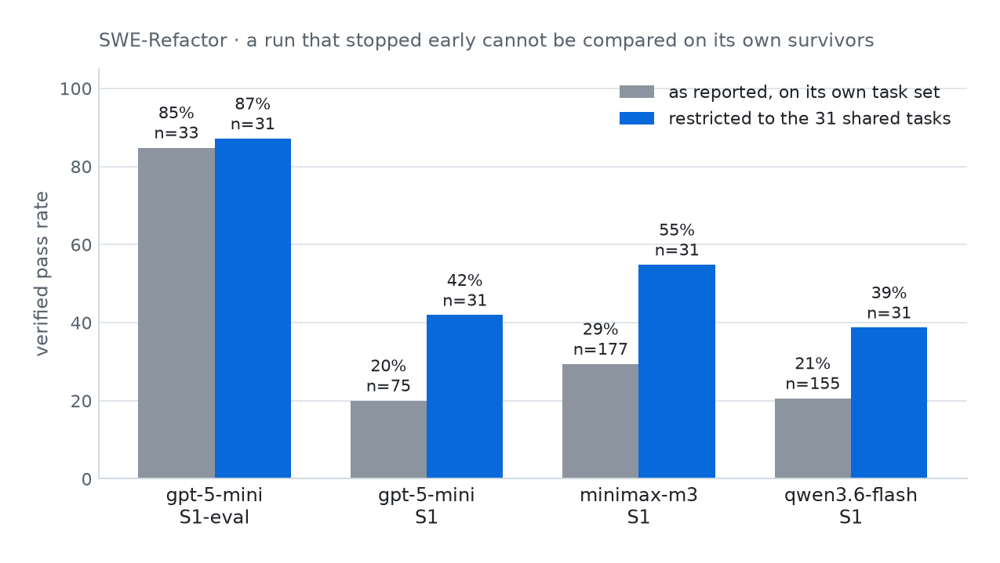

# Results

Two kinds of numbers are reported here, and they are kept apart.

* **Platform acceptance** — produced by this repository and reproducible today
  with [replication.md](replication.md).
* **Study results** — produced with the same evaluation pipeline during a larger
  campaign. They motivate the tool; they are not re-run by acceptance.

Every figure below is redrawn from the per-task CSVs in
[`exports/csv/`](exports/csv/) by `scripts/figures.py`, which recomputes each
number and refuses to render if it disagrees with the totals recorded in the
export. Nothing is estimated: a number that could not be measured is absent.

```bash
uv run --with matplotlib --no-project python scripts/figures.py
```

---

## 1. Platform acceptance

Four non-retrieval setups, both benchmarks, one task each, executed end to end
against a live provider: GitHub Copilot CLI driven through OpenRouter on the
`openrouter/free` model. Verdicts come from real test suites and real builds; no
mocks, no recordings. An additional RefactorBench S2-AST row exercises the
released retrieval path.

These rows establish benchmark outcomes and artifact capture. They predate the
enforced `setupCompliance` contract, so they are not evidence that the model
exercised each named regime; that requires re-running the matrix and reading the
setup-specific evidence described in [replication.md](replication.md).

| Benchmark | Setup | Passed | Agent | Eval | Decisive check |
|---|---|---|---|---|---|
| RefactorBench | S1 | ✗ | 268 s | <1 s | `workspace_changed`: no changes were made |
| RefactorBench | S1-LSP | ✓ | 474 s | <1 s | `python_tests`: 5/5 |
| RefactorBench | S1-eval | ✓ | 401 s | <1 s | `python_tests`: 5/5 |
| RefactorBench | S3 | ✗ | 1161 s | <1 s | `python_tests`: 3/5 |
| RefactorBench | S2-AST | ✓ | 163 s | <1 s | 12 snippets pre-injected; `python_tests`: 5/5 |
| SWE-Refactor | S1 | ✗ | 275 s | 75 s | `java_build`: compilation failed |
| SWE-Refactor | S1-LSP | ✓ | 939 s | 239 s | `java_build`: 2032/2032 |
| SWE-Refactor | S1-eval | ✓ | 381 s | 201 s | `java_build`: 2032/2032 |
| SWE-Refactor | S3 | ✓ | 749 s | 185 s | `java_build`: 2032/2032 |

The S2 row additionally spent `66.8 s` building a task-scoped index from 14,727
AST chunks (512 embedded candidates). It persisted three queries, 12 ranked hits,
`retrievalPreInjected=true` and `setupExercised=true`; an exact rerun reused the
same index in `3.53 s`.

In the SWE group the bare single agent wrote syntactically invalid Java and broke
the build, while a language server, a self-check loop and sub-agent delegation
each recovered the same task and passed the project's full suite. `2032` is the
entire `commons-io` suite, the same count an unmodified checkout produces.

### The baseline gate

A build failure is attributable to the agent only if an untouched checkout builds
green under the identical command, JDK, locale and user. Before any
SWE-Refactor result is recorded, the platform replays its own command on a clean
clone:

```
BUILD SUCCESS · Tests run: 2032, Failures: 0, Errors: 0, Skipped: 15
```

The gate has caught four defects that would otherwise have been recorded as agent
failures: a missing locale making the JVM default to ASCII, a root-vs-runner
identity mismatch, a `java.io.tmpdir` override that broke `FilesUncheckTest`, and
a truncated build command shipped inside the benchmark data itself.

---

## 2. Study results

### Structural detection and build survival diverge

<picture>
  <source media="(prefers-color-scheme: dark)" srcset="figures/swe-verification-funnel-dark.png">
  
</picture>

SWE-Refactor compound set, 177 Java tasks, `qwen3.6-flash`, single agent, single
pass. Nine tasks in ten produce code. Six in ten produce something
RefactoringMiner recognises as the requested refactoring. Fewer than three in ten
survive the project's own build and test suite — and only `43` do all three.

A harness that inspects only the target file reports `59 %`; running the
project's real build reports `24 %`. Both numbers describe the same runs.

| Refactoring | Passed | Tasks |
|---|---|---|
| Extract & Move Method | 42 | 142 |
| Move & Rename Method | 1 | 21 |
| Move & Inline Method | 0 | 14 |

Compound refactorings that move a member across types rarely survive a single
pass: they require every reference in the repository to be updated, and a change
that compiles in one file breaks another. Six tasks hit the wall-clock limit.

Source: [`exports/csv/swe_compound_qwen36flash_s1_FINAL.csv`](exports/csv/swe_compound_qwen36flash_s1_FINAL.csv).

### Chunking strategy decides whether retrieval helps

<picture>
  <source media="(prefers-color-scheme: dark)" srcset="figures/refactorbench-prompt-modes-dark.png">
  
</picture>

RefactorBench, 100 Python tasks, `qwen3.6-flash`, over two variables.

Prompt specificity moves the baseline agent from `48` to `73`: stating what,
where and how is worth `+25` points over stating what alone.

Retrieval strategy decides whether context helps at all. Chunking the repository
along its parse tree — whole function and class definitions — adds `+8` to `+13`
points on top of every prompt mode. Chunking it into fixed line windows scores
below no retrieval at all, `57` against `73` on the descriptive prompt: a window
that straddles a definition boundary supplies part of a function without the
rest. Both remain runnable setups (`s2_rag_ast`, `s2_rag_naive`), so the
comparison can be repeated.

### Why, measured on the index rather than argued from the pass rate

<picture>
  <source media="(prefers-color-scheme: dark)" srcset="figures/chunking-frontier-dark.png">
  
</picture>

"A window straddles a definition boundary" is a claim about the index, so it can
be checked without running an agent. `scripts/chunking_ablation.py` chunks all
nine repositories under each strategy and measures two properties of every
function and class definition, enumerated from the file's own parse tree so that
neither chunker is scored against its own notion of a unit:

* **integrity** — does some unit hold the whole definition?
* **purity** — of the tightest unit that does, how much *is* the definition? This
  is what retrieval spends: pulling one function drags in everything sharing its
  window.

| Strategy | Median unit | Integrity | Purity |
|---|---|---|---|
| AST | 11 lines | 91.9 % | 93.3 % |
| 20-line windows | 20 | 62.6 % | 30.3 % |
| 80-line windows | 80 | 90.8 % | 16.3 % |
| 240-line windows | 180 | 98.0 % | 10.0 % |

Size alone does not explain the gap. At a matched median unit size AST leads
integrity by `+29` points, and no window setting reaches AST's corner: a window
can exceed AST on integrity only by growing until it swallows everything, which
costs seven times the purity and a thirteen times larger payload.

At the 80-line default the two are almost tied on integrity — `90.8` against
`91.9` — and differ `5.7x` on purity. So windows do not fail to *contain* the
code; they fail to deliver it without noise, which is the same reason window
retrieval scores below no retrieval at all.

### The retrieval effect holds across models

<picture>
  <source media="(prefers-color-scheme: dark)" srcset="figures/refactorbench-models-dark.png">
  
</picture>

Four models, same benchmark, same descriptive prompt: AST retrieval helps every
one of them, by `+5` to `+13` points. Model choice matters independently — the
same benchmark and setup with a lazy prompt scores `48` on `qwen3.6-flash` and
`7` on whatever free model the `openrouter/free` router happened to serve
([`exports/csv/refbench_lazy_openrouter_free_s1.csv`](exports/csv/refbench_lazy_openrouter_free_s1.csv)).
The model is a variable of the experiment, not a property of the platform.

<picture>
  <source media="(prefers-color-scheme: dark)" srcset="figures/swe-models-dark.png">
  
</picture>

On the harder Java set the same single-pass regime reaches `24 %` and `29 %`,
against the `19 %` and `20 %` reported for GPT-4o-mini in the SWE-Refactor paper
and the `66 %` its multi-agent configuration reports. The hatched bars are
published references, not runs of this platform, and are shown only for scale.

### Truncated runs are scored on a matched subset

<picture>
  <source media="(prefers-color-scheme: dark)" srcset="figures/swe-matched-subset-dark.png">
  
</picture>

Two study runs ended before their task list did: `gpt-5-mini` under the eval loop
was rate-limited after 33 of 177 SWE-Refactor tasks, and the RefactorBench S3
sub-agent run crashed after 26 of 100. A pass rate over 33 tasks does not belong
on the same axis as one over 177 unless they are the *same* 33 tasks.

So every configuration is scored twice: as reported, and restricted to the `31`
tasks all four actually ran. Those 31 are easier than the full set — every other
configuration gains `18` to `26` points on them — and `gpt-5-mini` still leads at
`87 %`.

`scripts/matched_subset_analysis.py` computes this and writes
[`figures/matched_subset.json`](figures/matched_subset.json); `scripts/figures.py`
imports the same function to draw the figure, so the figure and the recorded
values come from one computation.

### Scope of these numbers

The study ran on the retrieval stack of its time. The released implementation
keeps AST-versus-window chunking, dense search, exact BM25, reciprocal-rank
fusion and cross-encoder reranking, and serves the study's embedding and
query-expansion models. Where a historical bar was produced with different
models, it needs a fresh, matched rerun before it can be compared with a current
deployment; the models and the pipeline are listed in
[Retrieval (S2)](retrieval.md#models).

---

## Reproducing

Acceptance results: [replication.md](replication.md). Study results were produced
with the same evaluation pipeline over the full task sets. The per-task CSV
export (`/api/runs.csv`) carries every column used to build these figures,
including `codebleu`, `contextTokens`, `compactionCount`, `costUsd`,
`retrievalPreInjected`, `retrievalInvocations`, `retrievalIndexKey`,
`setupCompliance` and `evalAttempts`. Per-task detail for every study run is in
[`exports/appendix_per_task.md`](exports/appendix_per_task.md).
