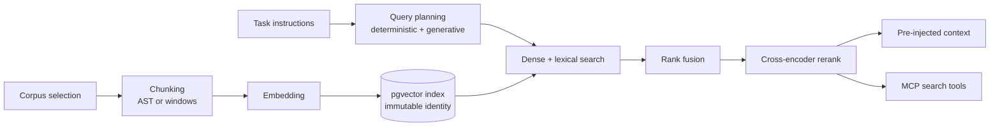
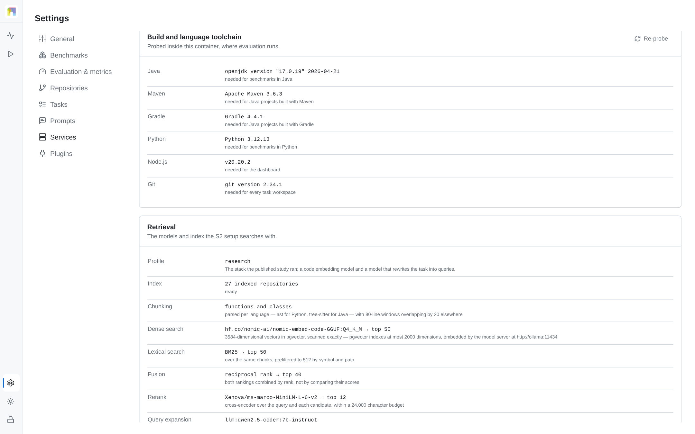

# Retrieval (S2)

The `s2_rag_ast` and `s2_rag_naive` setups give the agent a retrieval layer over
the repository it is about to change: an index of the source, a hybrid search
over it, a reranked context block injected into the prompt before the first
turn, and read-only search tools it can call for the rest of the session. The
two setups differ only in how the corpus is cut into units; everything after
that is identical, so a comparison between them isolates that one variable.

Retrieval is mandatory for these setups. If any stage of the pipeline cannot
run, the run stops with a stated reason instead of continuing as a weaker
configuration, so a run labelled S2 was executed as S2.

## Pipeline

### Corpus

Source files of the task's language, from the workspace as it exists at the
pinned commit. Generated, vendored and build output trees are excluded, as are
files above a size threshold, so an index describes the project rather than its
dependencies.

### Chunking

`ast` parses each file and emits whole definitions (classes, methods,
functions) with their symbol name, path and line range. A unit is therefore
something a refactoring can be applied to. Files that fail to parse fall back to
windows, and the count of such files is recorded in the index report.

`naive` cuts fixed line windows with overlap. It is the control condition, and
isolates how much of S2's effect comes from structure-aware units.

### Embedding and index identity

Chunks are embedded and stored in pgvector together with their metadata and a
lexical representation. An index is identified by benchmark, source, revision,
language, strategy, embedding model, embedding dimension and chunker version.
That key is immutable: change any component and the platform
builds a new index rather than reinterpreting vectors produced by a different
model. The key is recorded with every run, so a result can always be traced to
the exact index it was produced against.

### Query planning

The deterministic planner derives several complementary views of the task from
its own text: a broad natural-language query, an identifier query built from
symbols and paths mentioned in the instructions, and a target query for files
named in the task parameters. It is reproducible: the same task always plans the
same queries.

Generative expansion runs on top of it. A small instruction-tuned code
model rewrites the task into further queries, which recovers vocabulary the
instructions never use: the name of the helper the code actually calls, rather
than the paraphrase in the prompt. Expanded queries are added to the
deterministic ones, never substituted for them, and each query is recorded with
its origin in `queries.json`.

### Search, fusion, reranking

Each query runs twice: an approximate nearest-neighbour search over the vectors,
and an exact lexical search over the same chunks. Vector search finds code that
means the same thing; lexical search finds the identifier that was typed. The
two rankings are merged with reciprocal rank fusion, which needs no score
calibration between them, and the fused candidates are then scored by a
cross-encoder that reads query and chunk together. The reranked top hits are
what the agent sees.

A bounded prefilter keeps the embedded candidate pool to a fixed size on large
repositories: files named in the task parameters are protected first, then
full-corpus BM25 contributes candidates from each query view in round robin, so
one verbose query cannot consume the whole budget.

### Delivery

The top hits are rendered into a context block and pre-injected into the prompt,
labelled as evidence to be verified rather than instructions to be followed. The
same index is exposed for the rest of the session through MCP search tools bound
to a read-only database role, and every tool call is appended to
`invocations.jsonl`.

## Models

| Stage | Model | Where it runs |
|---|---|---|
| Embeddings | `nomic-embed-code` (3584-d) | the `ollama` service |
| Query expansion | `qwen2.5-coder:7b-instruct` | the `ollama` service |
| Reranking | `ms-marco-MiniLM-L-6-v2` cross-encoder | the API process |

These are the models the published study ran and what [Results](results.md)
reports. They are set in the `retrieval` section of `config.yaml`, which is where
they are defined; nothing repeats them. Each is part of the index identity, so
changing one builds new indexes rather than mixing vectors of different origins.

`docker compose up -d` starts the model server with the platform. Its first start
pulls the two models into the `ollama-models` volume, which takes as long as the
connection allows: while the pull is in progress retrieval reports
`provisioning`, S1 runs proceed, and S2 and S3 runs are refused with that
reason. An unreachable model server is an error, and S2 and S3 are refused with
that reason instead of falling back to a different model.

To produce embeddings somewhere other than the model server, set
`RETRIEVAL_EMBEDDER` to a `module:function` returning an object with
`embed_documents`, `embed_queries`, `model_name` and `dimension`. The index
identity follows that model name and dimension, so its vectors never land in an
index built by another embedder. The test suite uses this to embed
deterministically, which is how the retrieval tests run without a model server.

**Settings → Services** reports what the running deployment resolved these to,
stage by stage:

<picture>
  <source media="(prefers-color-scheme: dark)" srcset="figures/ui-retrieval-dark.png">
  
</picture>

Above 2000 dimensions pgvector cannot build an HNSW or IVFFlat index, so the
3584-dimensional vectors are scanned exactly instead. Recall
is total and the cost grows with the corpus; the published study searched its
index the same way.

## Relation to the Tipico prototype

This pipeline descends from the retrieval stack built during the Pi School
Tipico challenge
([PiSchool/Tipico---Multi-Agent-for-Code-Refactoring](https://github.com/PiSchool/Tipico---Multi-Agent-for-Code-Refactoring),
`rag/`). The study numbers in [Results](results.md) were produced on that stack.
What carried over unchanged, and what did not:

| Stage | Tipico prototype | Here |
|---|---|---|
| Embedding | `nomic-embed-code-GGUF:Q4_K_M`, 3584-d, via Ollama `/api/embed` | same model, same dimension, same transport |
| Vector store | pgvector, cosine (`<=>`) | same |
| Reranking | `cross-encoder/ms-marco-MiniLM-L-6-v2` | `Xenova/ms-marco-MiniLM-L-6-v2`, the ONNX port of that checkpoint |
| Query expansion | one generative rewrite | deterministic planner, plus a generative rewrite on top |
| Chunking | CocoIndex `SplitRecursively`, tree-sitter grammars, 2000-char target | tree-sitter and Python `ast` directly, whole definitions, no size target |
| Lexical search | none | exact BM25 over identifier-aware tokens |
| Rank fusion | candidate union, capped | reciprocal rank fusion |

The first three rows are why a Tipico-era result and a result from this
repository are comparable at all. The last three are additions, and they are the
reason [Results](results.md) says the study ran on the retrieval stack of its
time: **the published AST-versus-window comparison contains no BM25 and no rank
fusion**, because neither existed when it ran.

That does not weaken the comparison. `strategy` enters the pipeline only at the
index identity and the chunker (`server/app/retrieval/service.py`); every stage
after chunking is identical in both arms, so a lexical stage present in both, or
absent from both, cannot produce a difference between them.

## Failure behaviour

| Condition | Result |
|---|---|
| Retrieval database unreachable | run fails with the connection reason |
| Model server unreachable | run fails naming the host |
| Model server up, model not pulled yet | retrieval reports `provisioning`; S2 and S3 runs are refused until it is |
| Embedding dimension differs from the configured one | index build refused |
| Expansion model unreachable, or returns nothing usable | run fails; it does not fall back to the deterministic planner |
| Reranker unavailable | run fails; fused order is not served as if reranked |
| Chunking produces nothing | run fails rather than injecting an empty context |
| Operator stops the run during indexing | cancelled, partial index discarded |

A stated failure is recoverable by the operator; an unreported downgrade would
leave a result labelled S2 that was not produced under S2.

## Recorded evidence

Each S2 task writes, under its artifacts:

| File | Contents |
|---|---|
| `retrieval/queries.json` | every query, with its origin |
| `retrieval/hits.json` | every hit with path, line range, symbol, fusion and rerank scores |
| `retrieval/context.md` | the exact block injected into the prompt |
| `retrieval/provenance.json` | models, dimension, where embeddings were produced, expansion mode, index key and manifest, cache hit, latency |
| `retrieval/invocations.jsonl` | each search tool call the agent made |

`provenance.json` records which model server produced the embeddings, or the
custom embedder that replaced it.

## Tuning

Candidate counts, context size and window geometry are configurable
(`RETRIEVAL_PREFILTER_CANDIDATES`, `RETRIEVAL_VECTOR_CANDIDATES`,
`RETRIEVAL_LEXICAL_CANDIDATES`, `RETRIEVAL_FUSED_CANDIDATES`,
`RETRIEVAL_CONTEXT_HITS`, `RETRIEVAL_CONTEXT_CHAR_LIMIT`,
`RETRIEVAL_WINDOW_LINES`, `RETRIEVAL_OVERLAP_LINES`); see
[Configuration](configuration.md). Values used by an experiment belong in its
provenance, because a comparison across different values measures the
configuration rather than the setup.
