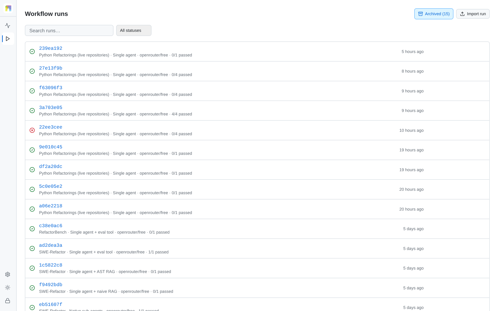
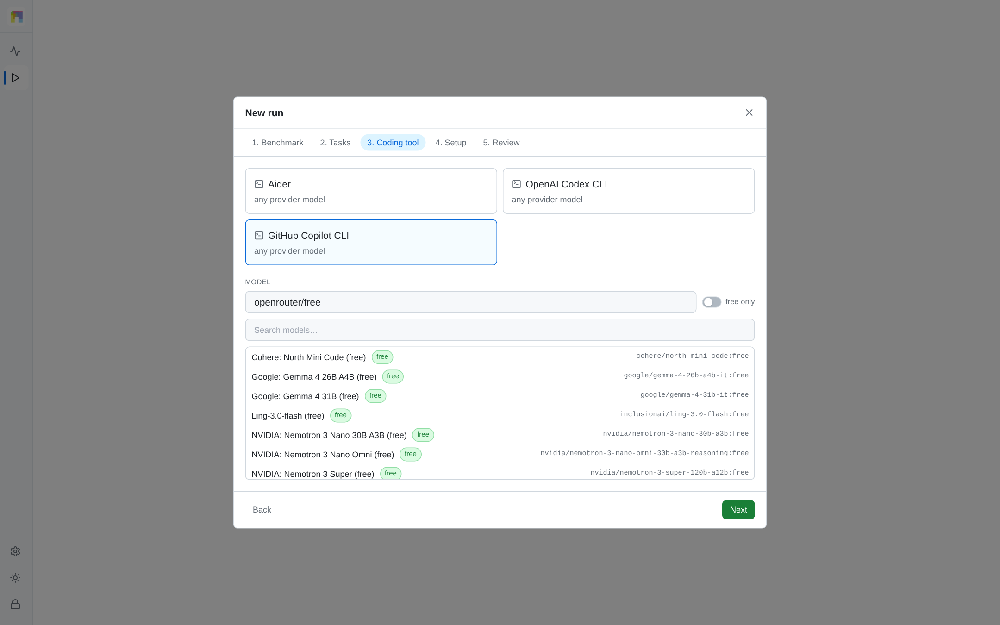
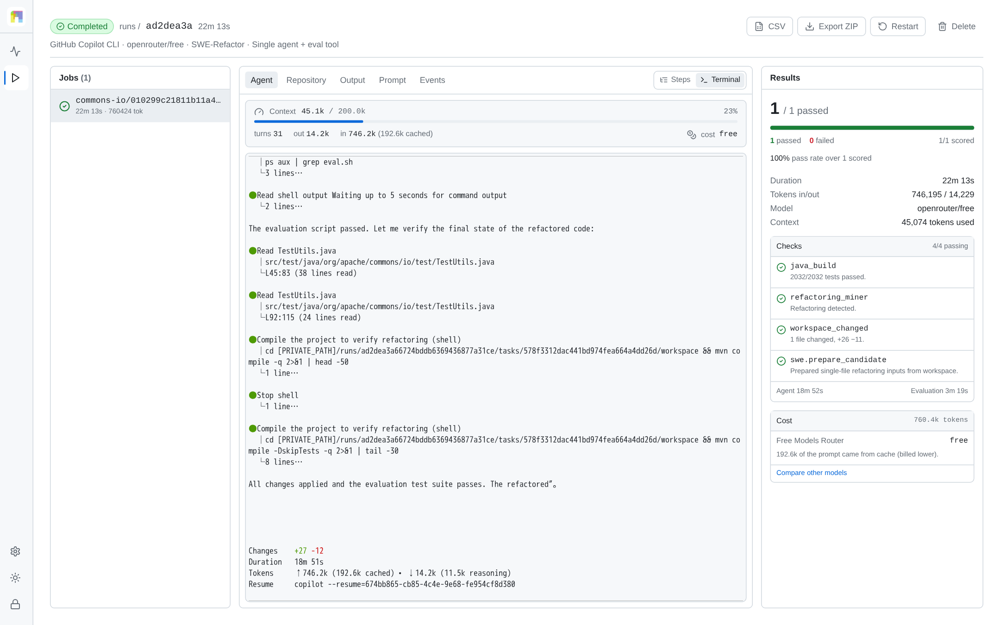
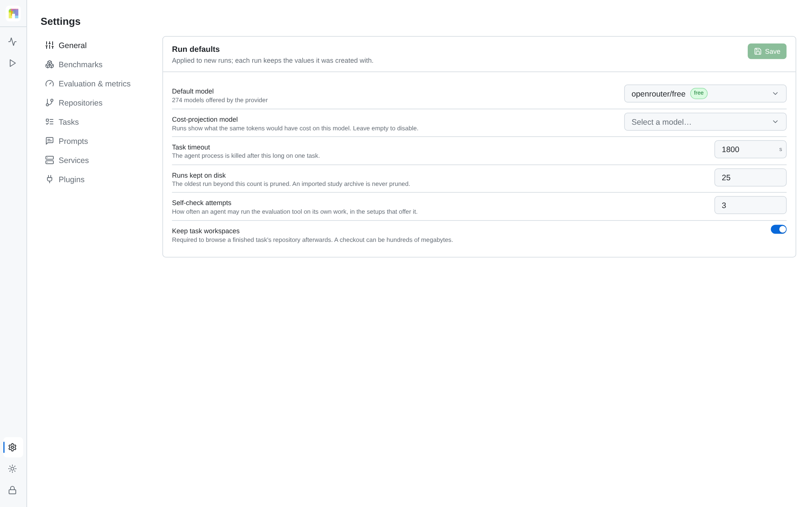

# Operator Guide

This guide covers the dashboard workflow after the platform is installed and
the benchmark catalog reports `ready`. See [Deployment](deployment.md) first.

## Dashboard pages

| Page | Purpose |
|---|---|
| **Workflows** | Active runs, recent runs, and the New run entry point |
| **Workflow runs** | Search, filter, import, export, restart, stop, and delete runs |
| **Run detail** | Task queue, live/replayed agent session, repository state, diff, checks, events, and artifacts |
| **Settings** | Plugin readiness, prompts/evaluation configuration, runtime defaults, credentials presence, and toolchain health |

<picture>
  <source media="(prefers-color-scheme: dark)" srcset="figures/ui-runs-dark.png">
  
</picture>

## Before the first run

1. Open **Settings → Benchmarks** and wait for the selected benchmark to report
   `ready`. First bootstrap can take a long time and needs network access.
2. Confirm the agent plugin is loaded and the relevant language server is
   available if you plan to use `s1_lsp`.
3. Confirm the provider credential reports `present`. The UI never displays its
   value.
4. For S2, confirm **Settings → Services** reports the model server ready,
   pgvector ready, and the expected embedding and reranker models.
5. Start with one task and a generous timeout before launching a campaign.

## Create a run

Select **New run** from Workflows. The wizard has five steps:

1. **Benchmark** — select a discovered, ready benchmark.
2. **Tasks** — filter by project and benchmark-defined facets, then select one or
   more tasks.
3. **Coding tool** — select the agent plugin and model. Custom model identifiers
   are accepted when the provider supports them. A tool whose CLI is absent from
   the backend cannot be selected, and its install command is shown instead.
4. **Setup** — choose one setup compatible with both the benchmark and agent. A
   setup the chosen tool cannot run names the capability it lacks.
5. **Review** — check the configuration and set the per-task wall-clock timeout.

<picture>
  <source media="(prefers-color-scheme: dark)" srcset="figures/ui-wizard-dark.png">
  
</picture>

Submitting creates a durable queued run. One run executes at a time, and tasks
within it execute in order.

## Setup behavior

| Setup | What the platform provides |
|---|---|
| `s1` | A clean workspace and one agent session |
| `s1_lsp` | S1 plus a language-server configuration |
| `s1_eval` | S1 plus an `eval.sh` self-check tool in the workspace |
| `s2_rag_naive` | S1 plus mandatory Retrieval (S2) over fixed line windows, hybrid search, prompt pre-injection, and optional read-only search tools |
| `s2_rag_ast` | S1 plus the same retrieval pipeline over Python/Java syntax-tree definitions |
| `s3` | S1 with the agent's native sub-agent capability enabled |

The platform records whether a mechanism was exercised. LSP, self-evaluation,
and sub-agent setups require an observed agent action. S2 is exercised when the
platform successfully pre-injects retrieved context; optional search-tool calls
are counted separately. Failed retrieval is `retrieval_unavailable`, never S1.
An incompatible agent/setup pair is rejected before queueing, and an unavailable
language server produces `setup_unavailable` instead of silently running S1.
Self-check attempts are capped and retained in the run export. For analysis,
use the CSV's `setupCompliance` alongside `passed`; the dashboard intentionally
keeps this research provenance out of the main task-result cards.

## Monitor a run

The run-detail page has three working areas:

- **Jobs** lists tasks, status, duration, setup evidence, and the agent/evaluate
  phases.
- **Session viewer** provides the live or archived Agent view, repository tree,
  diff/output, prompt, response, raw evaluation output, reference data where
  available, and structured events. The Agent view is a summary: one disclosure
  per turn, and a long reply is shown up to a bound with a note stating how much
  is not displayed. Output holds the reply in full and Terminal holds the raw
  session.
- **Results** shows benchmark verification stages as pending, running, passed,
  or failed, then displays the final machine-readable outcome.

<picture>
  <source media="(prefers-color-scheme: dark)" srcset="figures/ui-run-detail-dark.png">
  
</picture>

The live terminal is read-only. It streams raw PTY output over WebSocket. On a
finished task, the same `terminal.log` bytes are replayed; the transcript is not
reconstructed from formatted events.

<picture>
  <source media="(prefers-color-scheme: dark)" srcset="figures/ui-terminal-dark.png">
  
</picture>

## Statuses and outcomes

| Status | Meaning |
|---|---|
| `queued` | Persisted and waiting for the single worker |
| `running` | The run or task currently owns the worker |
| `passed` | All benchmark gating checks passed |
| `failed` | Agent work completed but one or more checks failed |
| `timed_out` | The task exceeded its wall-clock limit and its process group was killed |
| `skipped` | The operator skipped the task or stopped the run before it began |
| `stopped` | The operator stopped active execution |
| `error` | Platform, provider, plugin, or infrastructure failure prevented a normal verdict |

A failed benchmark task is valid experimental data. An `error` or
`provider_error` should be investigated before it is counted as model failure.
For S2, `retrieval_unavailable` identifies a database/model/index failure rather
than an agent or benchmark verdict.

## Run actions

- **Stop** kills the active task process group, marks remaining tasks skipped,
  and finalizes the run as stopped.
- **Skip** advances past the selected/current task.
- **Restart** creates a new run with copied configuration and task selection;
  the original run remains immutable.
- **Delete** removes a non-running run and its retained artifacts.
- **Export ZIP** includes `summary.json`, `results.csv`, and retained artifacts.
- **CSV** exports normalized task rows suitable for analysis.
- **Import** restores rows and retained artifacts from the platform ZIP format
  when the matching benchmark and agent plugins are installed. The hashed
  `manifest.json` is mandatory; archives in any other shape are rejected.

## Run defaults and retention

**Settings → General** holds the values applied to new runs: default and
cost-projection model, task timeout, how many runs are kept on disk, the
self-check attempt limit, and workspace retention. Each run keeps the values it
was created with.

<picture>
  <source media="(prefers-color-scheme: dark)" srcset="figures/ui-settings-dark.png">
  
</picture>

Keeping completed workspaces enables the post-run repository browser but can
consume substantial disk space. Turn **Keep task workspaces** off when only
results and captured artifacts are needed. The retention cap prunes old artifact
trees while structured run/result rows remain queryable.

The cap applies only to finished runs this installation executed. Imported
archives are never pruned and never count against the cap, because their
evidence cannot be produced again locally.

## Interpreting metrics

Token and context fields are shown only when the agent's event stream reports
them. Mid-session and routed-model fields may be incomplete. Missing data is
left missing rather than estimated. Cost is calculated only when a valid model
price is available.

For the exact pass criteria, see [Evaluation](evaluation.md). For known provider
and toolchain issues, see [Troubleshooting](troubleshooting.md).
For S2 evidence and metrics, see [Retrieval (S2)](retrieval.md).